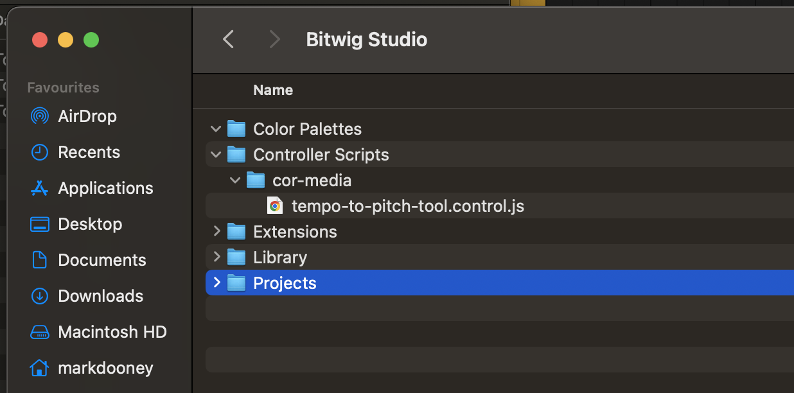
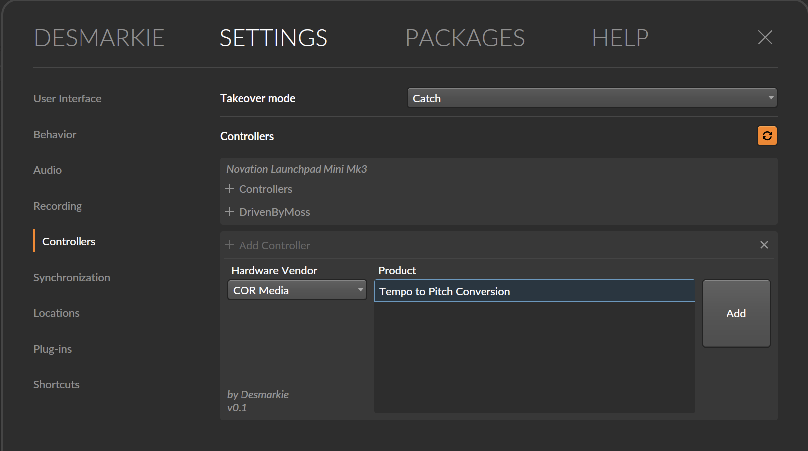
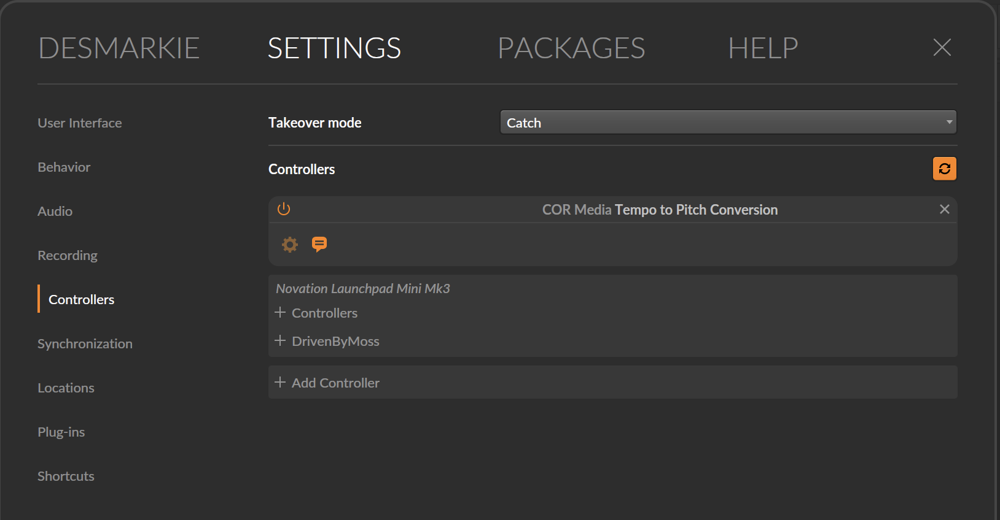
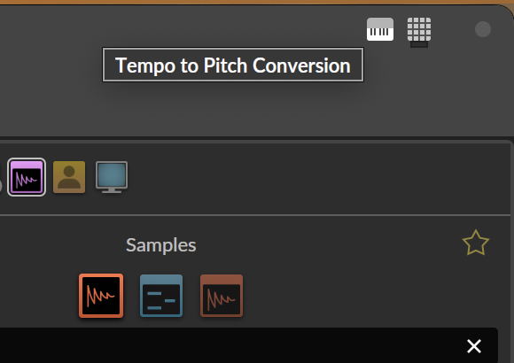
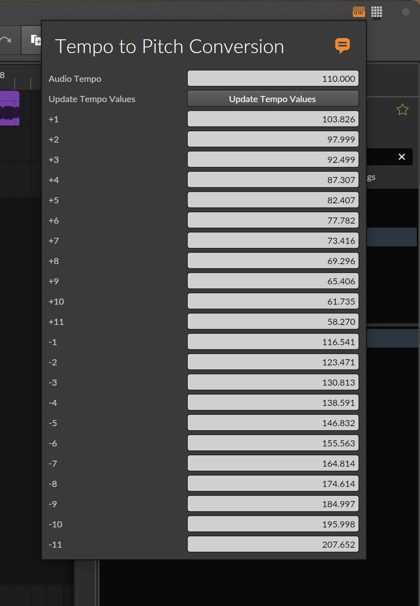

# Bitwig Tempo to Pitch Tool.  
  
Ableton Live users can re-pitch audio on a project timeline with a dial to adjust by semitones. It's an often requested feature for Bitwig despite not being present in any other major DAW.  
  
If you want to use the 'Repitch' stretch mode on your audio clips in the timeline and adjust by semitone without using a tuner to check your pitch is correct, you can use this tool to see what Tempo your audio clip should be set to for the same effect.  
  

## Installation and Usage.  
  
Download this Repo or the latest [Release](https://github.com/desmarkie/Bitwig-Tempo-to-Pitch-Tool/releases) and unzip.  
Copy the `cor-media` folder into the `Controller Scripts` folder where your Bitwig preferences are stored. These are usually located:  
On Mac `Users/<username>/Documents/Bitwig Studio/Controller Scripts/`  
On PC `%USERPROFILE%\Documents\Bitwig Studio\Controller Scripts\`  
  
  
  
In Bitwig, open your Settings tab and select Controllers from the left hand menu.  
Use the 'Hardware Vendor' dropdown in the 'Add Controller' box to locate `COR Media` and select it.  
Select `Tempo to Pitch Conversion` and click the 'Add' button.  
  
  
  
The controller looks like the below in Settings once it has been added.

  
  
You should now see a Keyboard icon in the top right of your Bitwig window representing the Tempo to Pitch tool. Click this icon to open the tool panel.  

  

Adjust the `Audio Tempo` value to match your Audio Clip's tempo in Bitwig, then click `Update Tempo Values`.  
The tempos below will update to the appropriate values letting you adjust your tempo by +/- 11 semitones. Copy and Paste onto your 'Repitch' Audio Clip as needed.  

  